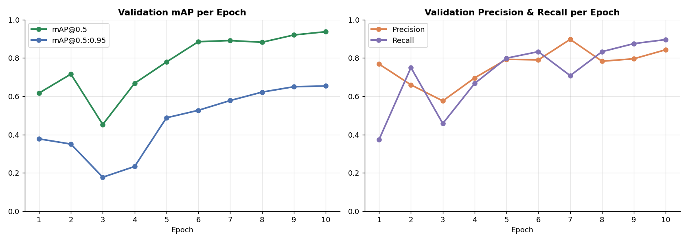
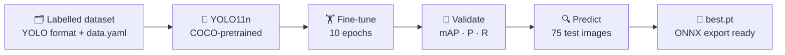
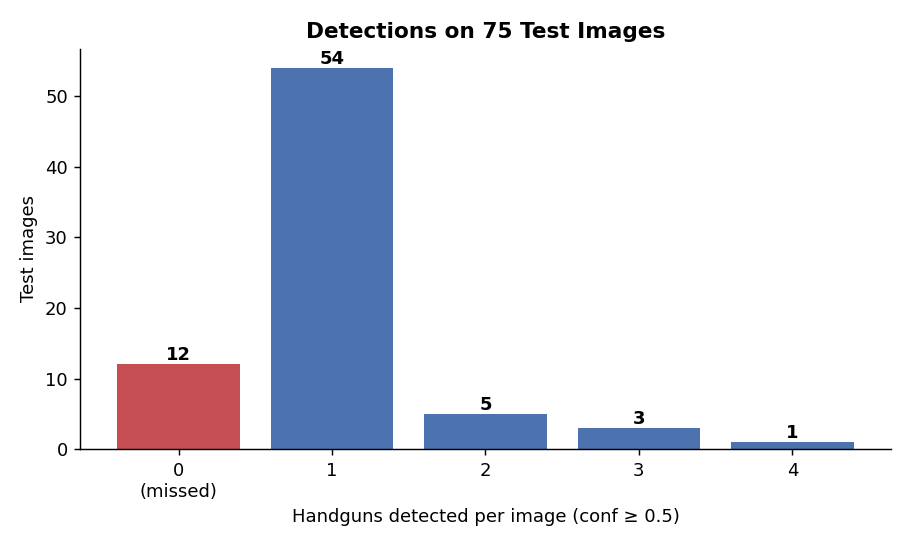

# 🔫 Custom Handgun Detection with YOLO11

[](https://colab.research.google.com/github/MMujtabaX/CV-Custom-Gun-OD/blob/main/CV_OD_Custom_C16.ipynb)


Fine-tuning a **YOLO11-nano** detector on a **custom handgun dataset**, a single-class object detection task with applications in security and surveillance. Starting from COCO-pretrained weights, the model reaches **0.937 mAP@0.5** after just 10 epochs (about 1 minute of GPU training).

<p align="center">
  
</p>

## 📌 The Task

Pretrained YOLO models know COCO's 80 classes, and **"handgun" isn't one of them**. Detecting a new object type requires **transfer learning**: keep the pretrained backbone's general visual features and retrain the detection head for the new class.

| Setting | Value |
|---------|-------|
| Base model | YOLO11n (2.58M parameters, 6.3 GFLOPs) |
| Pretrained weights | COCO (448/499 weight tensors transferred) |
| Classes | 1 (`handgun`) |
| Training images | 561 |
| Validation images | 20 (24 handgun instances) |
| Test images | 75 |
| Epochs / batch size | 10 / 8 |
| Optimizer | AdamW (auto-selected, lr = 0.002) |
| Image size | 640×640 |

## 🔄 Workflow



```python
model = YOLO("yolo11n.pt")
train_results = model.train(data="dataset/data.yaml", epochs=10, batch=8)
metrics = model.val()
results = model.predict(test_images, conf=0.5, save=True)
```

## 📊 Results

### Validation (best epoch)

| Metric | Score |
|--------|-------|
| Precision | 0.843 |
| Recall | 0.896 |
| **mAP@0.5** | **0.937** |
| mAP@0.75 | 0.689 |
| **mAP@0.5:0.95** | **0.654** |

**mAP@0.5 = 0.937** means the model finds handguns very reliably when a loose box overlap (IoU ≥ 0.5) counts as correct. **mAP@0.5:0.95 = 0.654** shows that box placement is good but not pixel-perfect, which is typical for a nano model after a short training run.

Training improved steadily: mAP@0.5 rose from **0.62 → 0.94** and recall from **0.38 → 0.90**, with both still climbing at epoch 10.

### Test-set predictions

<p align="center">
  
</p>

At a confidence threshold of 0.5, the model detected at least one handgun in **63 of 75 test images (84%)**. The 12 images with no detections are likely small, partly hidden or unusually angled guns that fall below the threshold. Lowering `conf` would catch more at the cost of more false alarms.

Inference runs at **~3.4 ms per image** on a GPU, fast enough for real-time video.

## 💡 Key Takeaways

- **Transfer learning makes custom detection cheap:** 561 images and 10 epochs were enough for 0.94 mAP@0.5.
- **The confidence threshold is a safety trade-off.** For a security system, a missed gun is far worse than a false alarm, so a lower threshold may be appropriate.
- **The validation set is small** (20 images, 24 instances), so the metrics have high variance. A larger validation set would give a more reliable estimate.

## 🔮 Next Steps

- Train longer, since all metrics were still improving at epoch 10
- Evaluate on the labelled test set with `model.val(split='test')` for proper test metrics
- Try a larger model (YOLO11s/m) for tighter boxes
- Run real-time detection on video or a webcam feed
- Export to ONNX for deployment (`model_best.export(format="onnx")`)

## 🚀 Run It

1. Download a handgun dataset in **YOLO format** and place it in a `dataset/` folder with `data.yaml`, `train/`, `val/` and `test/`.
2. Open the notebook in Colab with a **GPU runtime** and run all cells. YOLO11n's pretrained weights download automatically.

```bash
pip install ultralytics opencv-python matplotlib
```

## ⚖️ Responsible Use

This project is for educational purposes. Weapon detection systems can produce false positives and false negatives, so any real-world use should keep a human in the loop and follow local privacy laws.

## 🙏 Acknowledgements

Based on computer vision course material; notebook adapted and documented by me. Models by [Ultralytics](https://github.com/ultralytics/ultralytics).

## 👤 Author

**Muhammad Mujtaba Khan Suri** — CS @ UBIT, University of Karachi
[GitHub](https://github.com/MMujtabaX)
